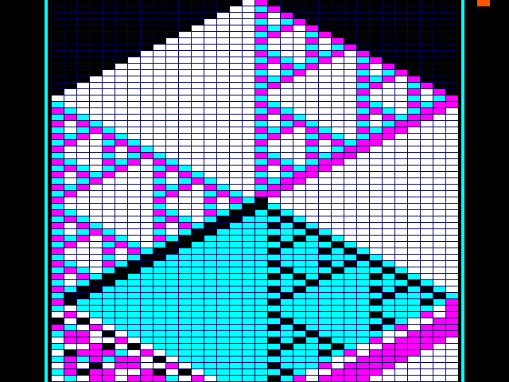

[](https://github.com/qd39l/echoscope/actions/workflows/gds.yaml)
[](https://github.com/qd39l/echoscope/actions/workflows/docs.yaml)
[](https://github.com/qd39l/echoscope/actions/workflows/test.yaml)

# EchoScope

**A butterfly-effect time machine on a tiny chip.**

Two tiny universes start one bit apart. Watch that difference spread across a
VGA screen, hear their disagreement, pause, flip another bit, and run time
backwards—exactly. The ASIC reconstructs its own past instead of recording it.



The fabrication target is **TTSKY26d / SKY130 / 1×1 tile / 25 MHz**.
The final local build fits one tile with **12,933.7 µm² of standard cells**,
zero physical or timing violations across nine corners, 15 passing Tiny Tapeout
prechecks, and five passing final-netlist tests. A two-tile reference was also evaluated; the
[PPA report](docs/ppa.md) records the comparison and architectural savings.
This repository includes synthesizable
Verilog, independent reference models, RTL and gate-level tests, a formal
inverse proof, the hardening flow, and a playable browser reference model.
See [verification](docs/verification.md) for measured results and submission status.

## Try it

Open `demo/index.html`, or run:

```sh
python3 -m http.server 8765 --bind 127.0.0.1 --directory demo
```

Then visit http://127.0.0.1:8765. Try **Clone A → B**, **Flip one bit**, and
**Play**. Pause, step forward, then backward: the entire picture returns.
The browser runs at 12 generations/s for inspection; silicon advances once
per VGA frame (59.524 generations/s). The browser is a mathematical reference,
not an HDL simulator. `docs/images/rtl-frame.png` is a real RTL pixel capture.

## How the hardware does it

Each world has two 32-bit state planes: past and present. A nonlinear,
second-order Rule 30 maps `(past, present)` to `(present, F(present) XOR past)`.
The inverse is `(F(past) XOR present, past)`. The two worlds together need
**128 bits of world state**, regardless of the rewind distance.

The VGA raster is the interesting hardware trick: the chip evolves the worlds
while it draws 60 successive rows, then applies 59 inverse steps in vertical
blanking. It recovers the original state before handling the next command.
There is no framebuffer, history memory, external RAM, or processor.
Pixel reads also use the serial datapath: each line rotates through the cells
and restores their ordering, avoiding two wide state-selection multiplexers.
After reset, 32 startup clocks initialize ordinary, non-resettable state flops.

The display overlays A in cyan and B in magenta; white is agreement on a live
cell, black is agreement on a dead cell. Amber mode isolates disagreement.
A disagreement meter controls a pentatonic square-wave tone. A diagnostic
mode scans all 128 state bits for board bring-up and gate-level testing.

Reversing evolution does **not** undo an intervention. Changing a bit creates
a new trajectory, including a new reconstructed past. Cloning destroys the
old B world. This is an exact reversible *simulation* implemented in ordinary
CMOS; it is not thermodynamically reversible computing.

## Reproduce

Install Icarus Verilog, Verilator, Node.js, Python 3.11, uv, and Docker.

```sh
./scripts/setup.sh
make test              # Lint + RTL, raster, controls, audio
.venv/bin/python tools/verify_model.py
make formal            # Exhaustive Yosys SAT proof in a network-disabled container
make gds               # LibreLane 3.0.14, SKY130, fixed 1x1 footprint
make physical-pin-audit
make gl-test           # Public-pin tests against the powered gate-level netlist
make precheck          # Official Tiny Tapeout geometric/electrical prechecks
make evidence          # Collect compact, checked verification results
make submission        # Build local submission package; does not upload it
make privacy           # Check publishable files and branch/tag/remote history
```

The checked package is written to `build/echoscope-ttsky26d-1x1.zip`.

The macOS flow streams only project source and support files into temporary,
network-disabled containers. It does not bind-mount host directories. It uses
the Docker-managed `ttsky26d-pdk-3.0.14` volume. See
[toolchain setup](docs/toolchain.md) for initializing that PDK cache and the
pinned tool versions. Generated runs and downloaded dependencies are ignored.
See [publication notes](docs/publication.md) for the privacy review scope and
public attribution policy.

## Hardware and submission

Use a Tiny VGA Pmod, a VGA display, and optionally a TT Audio Pmod. The
[datasheet](docs/info.md) documents every pin and control, and
[bring-up notes](hardware/README.md) describe diagnostic testing. The device
uses the standard Tiny Tapeout interface and common VGA/audio pinouts.

TTSKY26d was showing a deadline of November 30, 2026, 20:00 UTC, and sales had
not opened when checked on September 22. The live
[shuttle page](https://app.tinytapeout.com/shuttles/ttsky26d) is authoritative.
The design has not been purchased or submitted for fabrication.

## Originality and sources

The proposed contribution is this specific combination: two perturbable
reversible worlds, disagreement sonification, and a VGA engine that borrows
and restores the simulated state rather than buffering the picture. A focused
search found no matching Tiny Tapeout project. That is not a claim that no
similar design exists anywhere. The underlying mathematics is established.

- Toffoli and Margolus, [Cellular Automata Machines](https://people.csail.mit.edu/nhm/cam-book.pdf), chapter 14: second-order reversibility.
- [Tiny Tapeout VGA/audio pin conventions](https://tinytapeout.com/specs/pinouts/).
- [Official SKY130 HDL template](https://github.com/TinyTapeout/ttsky-verilog-template).
- [Earlier VGA cellular automata](https://znah.net/tiny_explorer/) and
  [Music for ASICs](https://tinytapeout.com/chips/ttgf26b/tt_um_d5smith_mfa)
  are related work, not claimed inventions here.

Apache-2.0; see [LICENSE](LICENSE).
