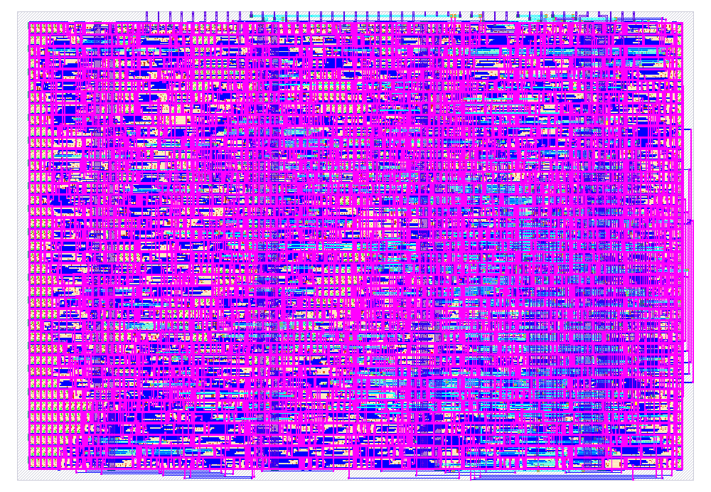

# Verification record

**Target:** TTSKY26d, SKY130A, 1×1, 25 MHz.

The final local implementation passes its physical and functional acceptance
checks. Clock gating is
restricted to the 128-bit world-state bank, which uses plain flops and serial
initialization. The controller holds outputs in a known state until the 32-clock
startup completes. Pixel reads rotate the state once per cell, restoring it
by the end of each line.
An earlier experiment that gated synchronously reset registers was rejected
by gate-level tests; an ungated alternative encountered severe routing congestion. See [PPA reasoning](ppa.md) for the alternatives and trade-offs.

The accepted serial-initialization/serial-VGA build uses placement density 68
and targeted exclusions of weak logic, delay and buffer cells. It occupies
**12,933.7 µm²** of standard cells, **78.42%** of the one-tile core. Routing,
Magic DRC, LVS, antenna, setup, hold, maximum slew and maximum capacitance
violation counts are all **zero**. Across all nine PVT/interconnect corners,
worst setup slack is **21.053 ns** and worst hold slack is **0.0371 ns**.
The earlier post-CTS repair warning refers to its requested extra hold margin;
final extracted timing meets the actual hold constraints at every corner.
The final powered netlist passes all seven applicable gate-level tests (one
RTL-only test is intentionally skipped), and its GDS passes all 15 official
Tiny Tapeout prechecks. Earlier rejected experiments remain in the PPA comparison.

## Functional evidence

- Verilator lint passes with `-Wall`.
- Eight RTL cocotb tests pass, covering public diagnostic pins, reset and enable,
  every perturbation cell, command priority, randomized commands, a 1,024-step
  forward/reverse round trip, busy pauses, and changes to controls during work.
- The raster test checks every output pixel over a full frame, including RGB,
  blanking, sync, and recovery of all 128 canonical state bits after drawing.
- A multi-frame test checks pause, forward/reverse, clone, perturbation,
  disagreement measurement, scan restoration, audio activity and mute.
- Six Yosys SAT proofs pass: the abstract inverse in either direction for all
  64-bit world states; and the serial engine's evolution, perturbation, clone,
  and identity scan for all 128-bit paired states. The serial proofs also
  check the final disagreement count, equality indication and idle state.
  Arbitrary input direction and address are latched at acceptance; neither is
  assumed constant while the operation runs. Completion proofs assume enable
  remains high and reset inactive. A separate startup proof establishes the
  exact seed after reset and 32 initialization edges, from arbitrary stored
  bits and with arbitrary enable. Reset, restart and pause/resume are also
  checked in simulation.
- The JavaScript browser model agrees with an independent scalar Python
  truth-table model on 256 randomized states × four operations.
- The accepted build's final powered netlist passes all seven applicable
  tests, including the 1,024-step round trip, initialization interrupted by
  reset, initialization while disabled, and package-pin VGA reconstruction.
  A different physical build requires fresh netlist tests and layout prechecks.
- The interruption suite covers every processing cycle of forward, reverse,
  perturbation, clone and identity scan with pause/resume and reset (320 cases),
  and reset at every initialization position with enable high/low (64 cases).
  It uses only package pins and runs on RTL and the powered netlist.
- Two additional inductive proofs establish engine pause/progress invariants
  and the normal-video controller's complete scan/restore schedule. After reset,
  with diagnostic mode low and arbitrary enable pauses and other controls,
  each row scan finishes its 32 rotations, 59 drawing evolutions are balanced
  by 59 inverse operations, and the engine is idle before command acceptance.
  Together with the arbitrary-state engine and inverse proofs, this establishes
  canonical-state recovery before commands. It is a compositional proof,
  not a full pixel-renderer proof. Output masking and command exclusivity are
  also asserted. Two deliberately broken RTL copies produce bounded
  counterexamples, demonstrating sensitivity to missing enables and commands
  accepted during active video. Original synthesizable sources are unchanged.

The browser is a reference model, not an HDL simulator. The image in the README
is captured from the real RTL outputs. Board bring-up code is supplied, but no
fabricated device or FPGA board has been tested.

## Physical acceptance criteria

Two clock-buffer outputs, `clkbuf_0__0653_/X` and `clkbuf_0_clk_regs/X`, each
have fanout 16 against a configured limit of 10. These specific exceptions are
accepted for this build; fanout is not claimed to be zero. `make timing-audit`
rejects additional/different exceptions. It also checks all nine corners for
clean unconstrained-path diagnostics, zero unannotated functional nets,
propagated clock latency, and explicit setup/hold paths to the clock-gate latch.
Every reported clock-gating slack is nonnegative. The I/O budget remains 8 ns
on all data/control ports, with no false-path or multicycle exceptions.

A successful build must meet all of these; producing a GDS file is insufficient:

- Exact 161 × 111.52 µm one-tile footprint and all template pin positions.
- All 40 used signal pins connected to routed cells; all 43 signal and two
  supply pin shapes present. Three unused `uio_in[7:5]` inputs are intentional.
- Zero detailed-routing, Magic DRC, LVS, antenna, and critical disconnected-pin errors.
- Nonnegative extracted setup and hold slack in all nine PVT/interconnect
  corners; zero maximum slew and maximum capacitance violations.
- Official Tiny Tapeout precheck passes all 15 applicable checks: Magic DRC;
  KLayout FEOL, BEOL, off-grid, pin-label overlap, zero area and macro/layer
  checks; template pins, boundary, supply pins, legal layers, cell names,
  urpm/nwell separation, analog-pin consistency, and Verilog syntax.
- Final powered netlist passes public-pin gate-level diagnostic tests and a
  package-pin VGA test covering a full frame and the next frame's state.

The stock 40 ns clock constraint includes 8 ns input/output delay budgets,
0.25 ns clock uncertainty, and the flow's 5% timing derate. Gate-level tests use
functional standard-cell models with unit delays, not SDF back-annotation;
extracted multi-corner STA supplies timing verification. The macro's physical
power connections are checked, but top-level shuttle integration remains the
Tiny Tapeout team's responsibility.

## Reproduction and boundaries

See [toolchain.md](toolchain.md) and the root Makefile. Full local build reports
are in `runs/wokwi/`, test results in `build/verification/`, and official precheck
reports in `build/precheck/tt/precheck/reports/`. Compact final evidence is
stored in `docs/verification/`, including input hashes, artifact hashes,
test results, synthesis statistics and the nine-corner timing summary.
The exact attribution-only metadata change made for publication is recorded
separately in `verification/metadata-update.json`; see
[publication notes](publication.md). Original physical-build hashes are preserved.
The local package is `build/echoscope-ttsky26d-1x1.zip`. Packaging checks
that GDS, LEF, powered netlist and all three SPEFs match the accepted build.
GDS/OAS conversion preserves mask geometry on all 34 layers and all 19,819
unique label values and locations; the hashes are in `verification/package.json`.

Hosted GDS, precheck, gate-level, test and docs workflows passed for public
commit `95b0c9f`; the GDS workflow is
[35931156455](https://github.com/qd39l/echoscope/actions/runs/35931156455).
Its powered netlist matches the accepted local netlist byte-for-byte; local
comparison found identical GDS mask geometry and labels despite different
file hashes. Newly added verification must pass on the final published commit
before treating that commit's hosted status as current.

The design has not been recorded here as submitted to the shuttle, purchased,
or assigned a fabricated project index. Official hosted CI and shuttle
submission remain separate from the local validation recorded here. No
universal originality or measured silicon power claim is made.

## Evidence freshness and proof boundaries

`make test`, `make gl-test`, `make formal`, `make formal-safety`, `make equivalence` and
`make precheck` now issue receipts only after successful completion. Receipts
hash their test/proof sources, relevant design inputs and results; inputs are
checked before and after execution. `make evidence` rejects stale or altered
receipts. Video reports include the receiver, reference model and bridge
hashes as well as the simulated RTL/netlist and cell models. Formal safety
and simulation results do not replace the unchanged physical-build manifest.
The full video regressions each validate 63 complete frames, including 18
pause/reset boundary cases and 16 randomized command combinations, using only
the output pins to reconstruct the image. See [video validation](video-validation.md).
Simulation runners bypass existing Python bytecode caches, including copied
caches whose source timestamp and size still match. A negative test explicitly
constructs that stale-cache condition and checks the fresh-import behavior.

`make release-check PDK_ROOT=/path/to/pdk` runs the local signoff sequence.
It requires `make equivalence`: UNKNOWN, TIMEOUT or FAIL is never promoted
to equivalence. Its wrapper provides stable inputs
before clock edges; the gate model retains the transparent-low clock-gating
latch and assumes ideal supplies. `make clockgate-model-test` compares that
latch translation against the pinned PDK UDP over 256 enable sequences and
8,192 observations. Physical-only fill/tap cells have no logical outputs and
remain covered by LVS/precheck.

Whole-design RTL-to-final-powered-netlist equivalence passes all 13 partitions,
including the stateful partition and every package output. The proof retains
relationships between aliased signals and explicitly matches the two identical
RTL registers that synthesis merged (`last_buttons[3]` and `difference_view`).
Both registers remain equivalence obligations. The phase wrapper advances on
every formal tick and permits new inputs once per clock cycle, during its low
phase. This is a functional proof under that synchronous input contract and
ideal supplies; extracted timing checks remain separate. Current source hashes
and per-partition results are preserved in `verification/equivalence.json`.

A local Icarus `-gspecify` probe with a deliberately violated setup constraint
did not trigger the timing notifier. Accordingly, no SDF timing-check signoff
is claimed with this simulator. Extracted multi-corner STA supplies timing
signoff; gate regressions remain functional unit-delay simulations.
